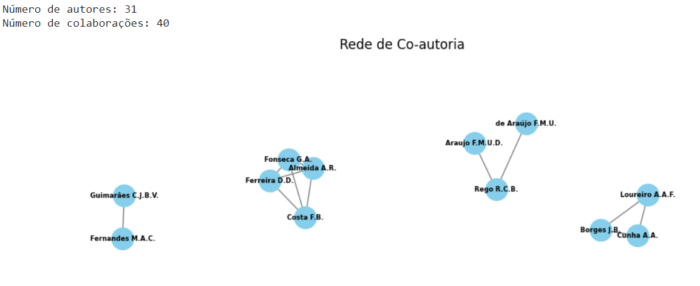
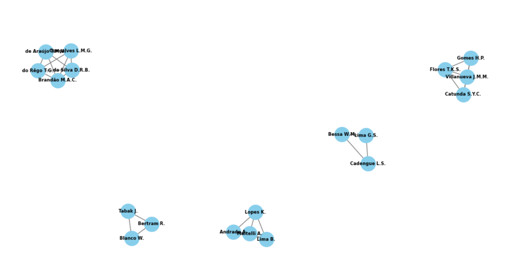
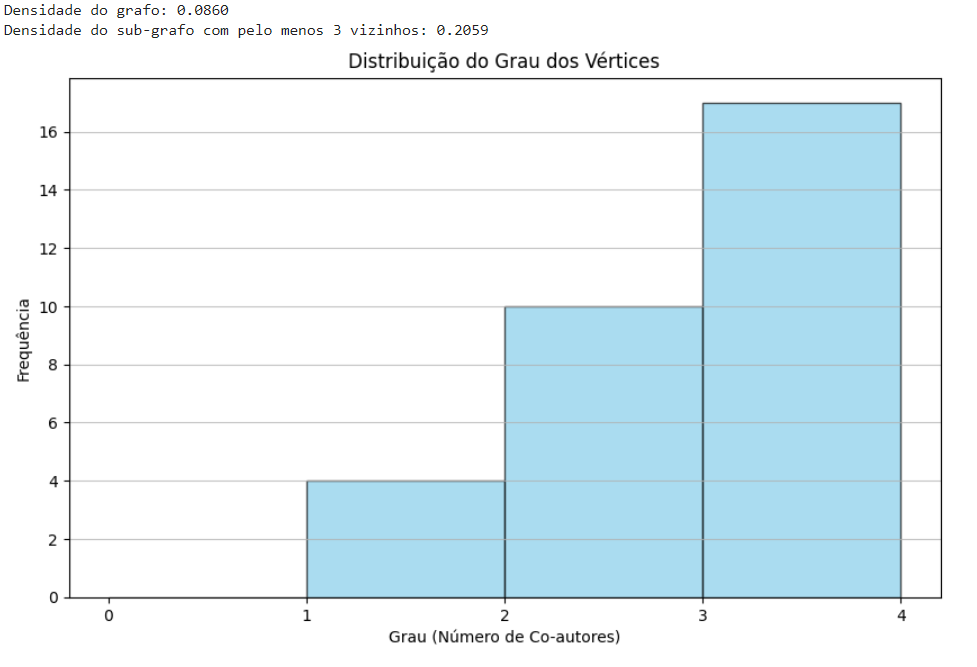

# Trabalho 2 Unidade 1
### O trabalho proposto tem como objetivo reforçar conceitos de grafos utilizando a biblioteca NetworkX no Python.

#### Discentes: Gabriel Vitor Pereira dos Santos and João Victor Soares da Silva Vieira.
#### LINK DO VÍDEO: https://www.loom.com/share/55c30539c9cc44bdae78bd1fa9f60abe?sid=b8ebcc54-a875-4e88-b60e-4537794f3e5c

Passo a Passo do trabalho:

* Importar as bibliotecas necessárias e o arquivo .csv baixando pelo SCOPUS(Elsevier). TEMA: CIÊNCIA DA COMPUTAÇÃO.

*  Análise de rede: Densidade da Rede, Sub-Grafo, Histograma dos Graus;

