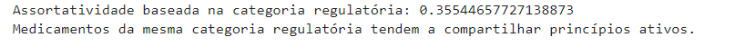
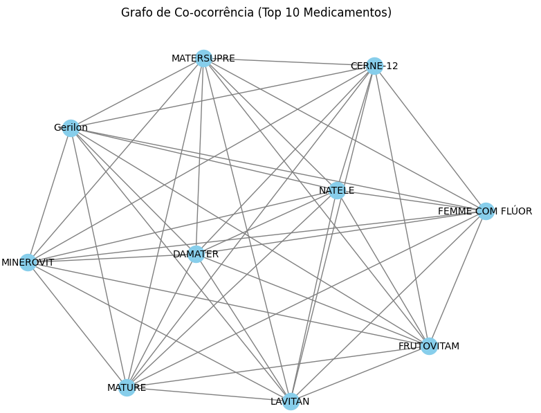
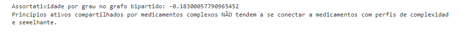
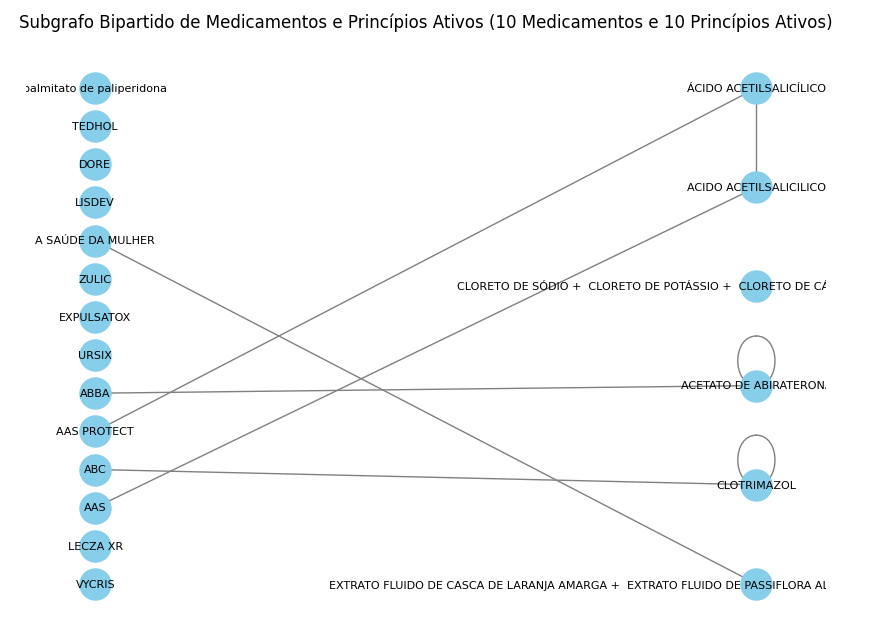
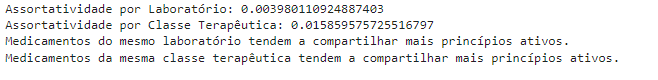
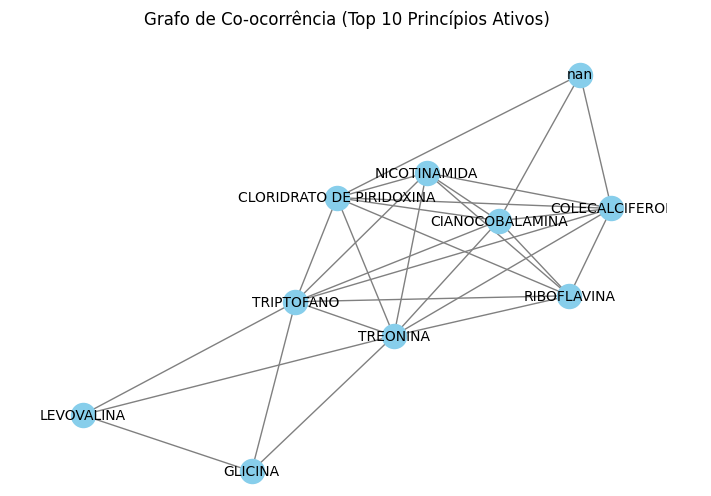

# U1T3 - Registered Drugs in Brazil | 🇧🇷

### Open Data on Drugs:
##### The open database of drug registration is a data intelligence project that extracts information from the Datavisa system to list products that have been registered by Anvisa, including those whose registration is either valid or canceled/expired, as reported on the Agency's consultation portal.

#### Students: Gabriel Vitor Pereira dos Santos and João Victor Soares da Silva Vieira.

### 🔗 Video with the explanation of the assignment [here](https://www.loom.com/share/08cd6f3741e84edeb47a4ecd0dc8b0b4?sid=09f2361b-b883-4df3-8764-b87d65542a14).
##### Hipóteses a serem testadas:
1. **Hypothesis of Regulatory Category:**
   - Do drugs within the same regulatory category tend to share more active ingredients?

2. **Hypothesis of the Company:**
   - Do drugs from the same company tend to share more active ingredients?

3. **Hypothesis of Complexity:**
   - Do drugs with more active ingredients tend to connect with drugs of similar complexity?

#### References

- :books: [Coscia, Michele. The Atlas for the Aspiring Network Scientist](https://www.networkatlas.eu/)
  

> **Network #01**  
Co-occurrence of Active Ingredients among Drugs
- **Nodes (Vertices):** Each drug is a node.
- **Edges:** An edge exists between two drugs if they share at least one active ingredient.
- **Assortativity:** Calculate the assortativity based on the regulatory category of the drugs.

**Question to be answered:**
- Do drugs within the same regulatory category tend to share active ingredients?

----------------

> **Network #02**  
Bipartite Graph of Drugs and Active Ingredients
- **Nodes (Vertices):** Drugs and active ingredients are distinct nodes.
- **Edges:** An edge connects a drug to its respective active ingredients.
- **Assortativity:** Calculate the assortativity by degree within the bipartite graph to determine if active ingredients connecting to complex drugs (with many active ingredients) also tend to connect to drugs with similar complexity profiles.

**Question to be answered:**
- Do active ingredients shared by complex drugs tend to connect to drugs with similar complexity profiles?

-----------------

> **Network #03**  
Co-occurrence by Company or Therapeutic Class
- **Nodes:** Each drug is a node.
- **Edges:** An edge exists between two drugs if they share at least one active ingredient.
- **Assortativity:** Calculate the assortativity based on the company or therapeutic class of the drugs.

**Question to be answered:**
- Do drugs from the same company or therapeutic class tend to share more active ingredients?

----------------
# Results:
#### REDE 01

#### REDE 02

#### REDE 03

