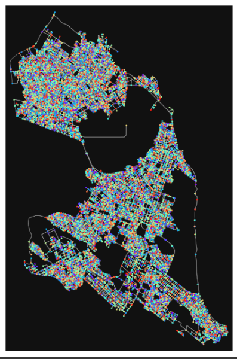
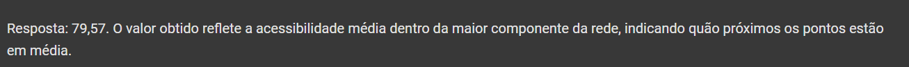
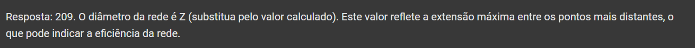
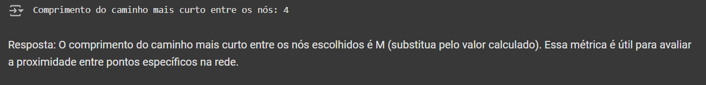
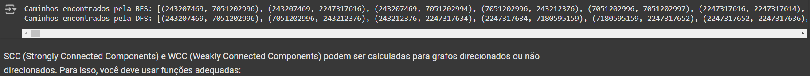
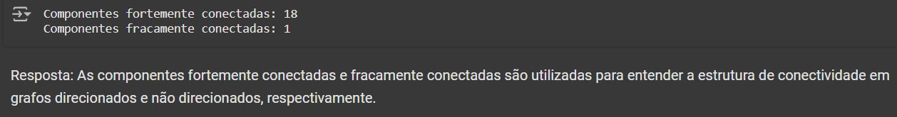
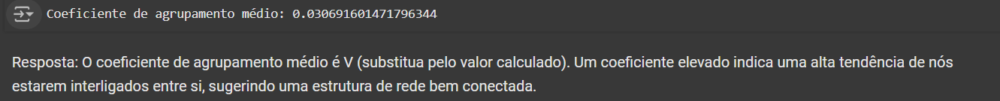

# U1T4 - Criar uma rede referente a cidade Natal-RN

#### Student: Gabriel Vitor Pereira dos Santos.

### 🔗 Video with the explanation of the assignment [here]

#### References

- :books: [Coscia, Michele. The Atlas for the Aspiring Network Scientist](https://www.networkatlas.eu/)
- https://github.com/gboeing/osmnx-examples

### Métricas estudadas e usadas:
* Cycles; 
* Average Shortest Path Length; 
* Diameter of Network;
* Shortest Path Length; 
* Connected Components; 
* Giant Connected Components; 
* number connected components, BFS, DFS, SCC, WCC;
* Clustering Coefficient.

Principais resultados de acordo com cada tópico:
## Gráfico de Natal-RN

## Cycles: Quantos ciclos independentes existem na rede de Natal?

## Average Shortest Path Length: Qual é o comprimento médio do caminho mais curto na rede?

## Diameter of Network: Qual é o diâmetro da rede?

## Shortest Path Length: Qual é o comprimento do caminho mais curto entre dois nós?

## Connected Components: Quantos componentes conectados existem na rede?

## Giant Connected Components: Qual é a quantidade de componentes gigantes conectados?

## Observações sobre BFS, DFS, SCC, WCC: 
#### BFS (Busca em Largura) e DFS (Busca em Profundidade) são algoritmos que podem ser utilizados para explorar a rede, mas não são diretamente quantificáveis como as métricas acima. Você pode utilizá-los para verificar a conectividade ou explorar caminhos.

#### SCC (Strongly Connected Components) e WCC (Weakly Connected Components) podem ser calculadas para grafos direcionados ou não direcionados. Para isso, você deve usar funções adequadas:

## Clustering Coefficient: Qual é o coeficiente de agrupamento médio da rede?

