# U1T5 - Criar uma rede referente aos Bairros perto da UFRN.

#### Student: Gabriel Vitor Pereira dos Santos.

### 🔗 Video with the explanation of the assignment [here](https://www.loom.com/share/0445b33a5aa94b67a7f7851ddf785034?sid=767dc4ab-7e4e-4434-abf6-853012a5ebda).

#### References

- :books: [Coscia, Michele. The Atlas for the Aspiring Network Scientist](https://www.networkatlas.eu/)
- https://github.com/gboeing/osmnx-examples
---------------


1. Instalar a biblioteca OSMnx.
```
pip install osmnx
```
2. Baixar a rede de Campim Macio e Nova Descoberta, e exibir um gráfo:
```
   # Coordenadas para os bairros de Campim Macio e Nova Descoberta
campim_coordenadas = (-5.837, -35.203)
nova_coordenadas = (-5.821, -35.209)

# Baixar a rede viária para cada bairro com raio de 3000 metros para cobrir uma área ampla
G_campim = ox.graph_from_point(campim_coordenadas, dist=3000, dist_type="network", network_type="bike")
G_nova = ox.graph_from_point(nova_coordenadas, dist=3000, dist_type="network", network_type="bike")

# Unir as redes dos bairros em um único grafo
G_combined = nx.compose(G_campim, G_nova)

# Visualizar a rede combinada com configurações personalizadas
fig, ax = ox.plot_graph(
    G_combined,
    figsize=(12, 12),
    node_size=5,
    edge_color="white",
    edge_linewidth=0.3,
    bgcolor="black"
)
```

# Gráfo de Nova Descoberta e Campim macio:
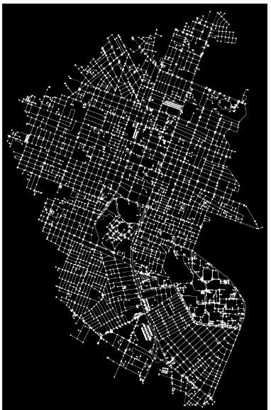

## Requisito 1:

### 1. Centralidade de Grau (Degree Centrality)
A Centralidade de Grau mede o número de conexões de cada nó na rede. Ela nos ajuda a identificar quais nós estão mais conectados, indicando pontos de alta acessibilidade.

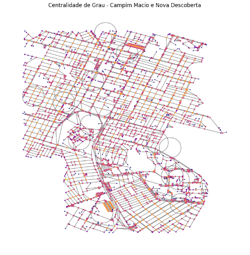

### 2. Centralidade de Proximidade (Closeness Centrality)
A Centralidade de Proximidade calcula a distância média de um nó para todos os outros. Nó com maior proximidade é central, pois consegue alcançar outros nós em menos passos.

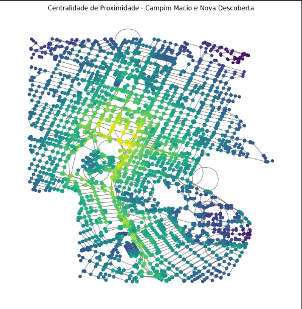


### 3. Centralidade de Intermediação (Betweenness Centrality)
A Centralidade de Intermediação mede quantas vezes um nó aparece nos caminhos mais curtos entre outros pares de nós. Um nó com alta intermediação é importante para conectar partes diferentes da rede.

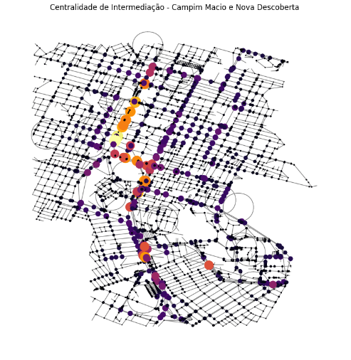

### 4. Centralidade de Autovetor (Eigenvector Centrality)
A Centralidade de Autovetor mede a importância de um nó com base na importância de seus vizinhos. Nó com alto valor de autovetor é influente, pois está conectado a outros nós influentes.

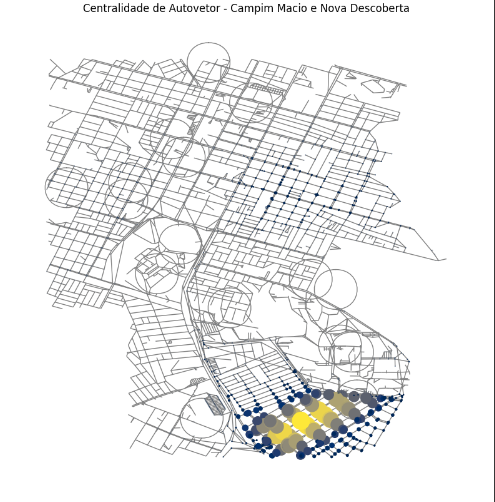

## Requisito 2:

### Curva de Distribuição de Graus

A curva de distribuição de graus estima como os graus dos nós estão distribuídos ao longo da rede. Ela oferece uma visão sobre a frequência de diferentes valores de grau, ajudando a identificar quais são os graus mais comuns.

O grau predominante na rede é cerca de 3, sugerindo que a maioria dos nós possui aproximadamente 3 conexões.

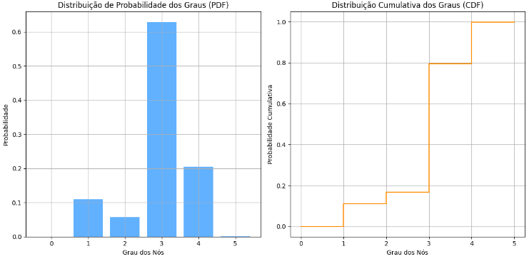

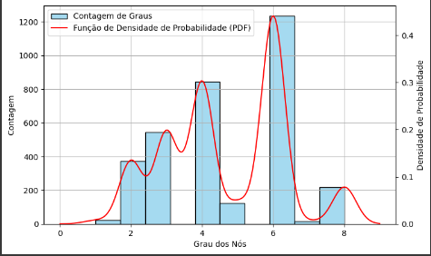
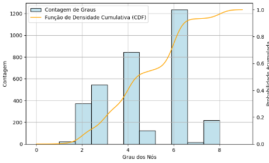

## Requisito 3:

### Estudo da Correlação entre as Métricas de Centralidade
A análise das correlações das métricas de centralidade ajuda a entender como diferentes medidas de importância dos nós se relacionam. A diagonal da matriz de correlação mostra a distribuição de cada métrica separadamente, enquanto os valores fora dessa diagonal indicam a relação entre as métricas.

Se as distribuições de degree e betweenness se sobrepõem fortemente, isso sugere que os nós com muitos links também tendem a ser os mais influentes em termos de intermediação de caminhos.

Degree e Betweenness: A correlação positiva entre essas métricas indica que os nós mais conectados geralmente têm um papel central na mediação de conexões entre outras partes da rede.

Closeness e Betweenness: A correlação moderada entre essas métricas sugere que os nós centrais, ou seja, aqueles mais próximos de todos os outros, também são importantes para interligar diferentes áreas da rede.

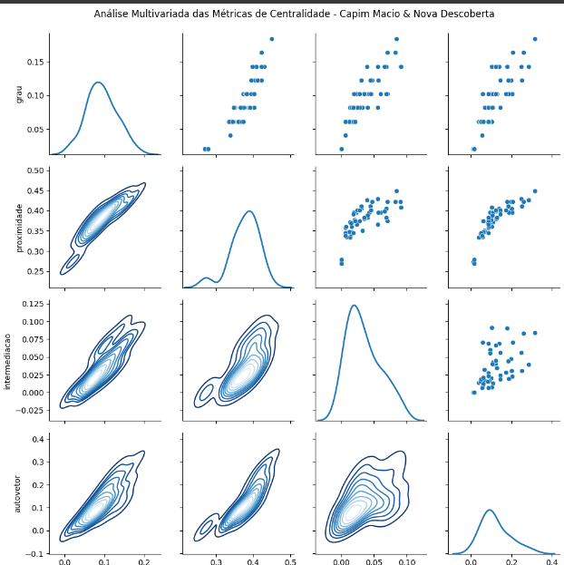

## Requisito 4:

### Estrutura Core/Shell na Rede
A estrutura core/shell descreve como os nós de alta conectividade (core) se diferenciam daqueles de menor conectividade (shell). O core é formado pelos nós mais conectados, enquanto o shell consiste nos nós mais periféricos da rede.

Os nós do core, indicados pela cor vermelha, são cruciais para a conectividade da rede, com um número elevado de conexões. Esses nós são importantes hubs, servindo como pontos chave em sistemas de transporte ou mobilidade, como estações de bicicletas.

Por outro lado, os nós do shell, em azul, têm uma conectividade mais baixa e se localizam nas extremidades da rede. Embora menos conectados, esses nós desempenham um papel importante ao conectar áreas mais distantes da rede central.

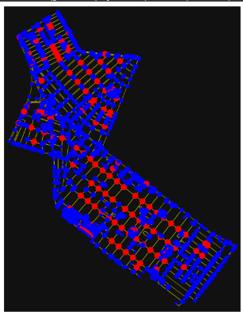
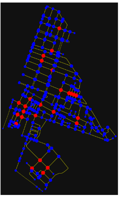


# Onde eu poderia colocar dock-station(S) de compartilhamento de bicicletas?

#### Com base nessa análise, podemos concluir que os pontos com alta centralidade de grau e alta centralidade de betweenness são ideais para as dock stations. Esses locais representam as áreas mais conectadas e acessíveis da cidade. Além disso, devemos considerar a proximidade de pontos de transporte público e áreas de alto fluxo de pessoas para maximizar a utilização do sistema.

#### Essa análise ajudará a otimizar o uso das bicicletas compartilhadas e garantir que as pessoas tenham fácil acesso às dock stations, principalmente nas regiões mais movimentadas da cidade.

