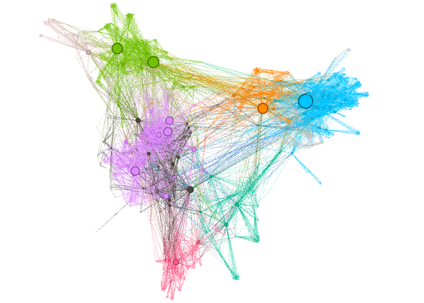
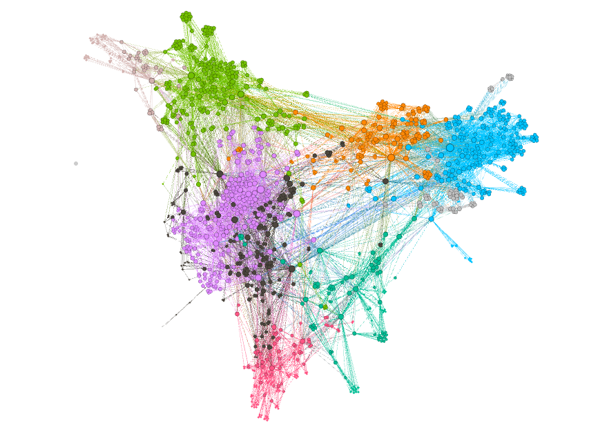
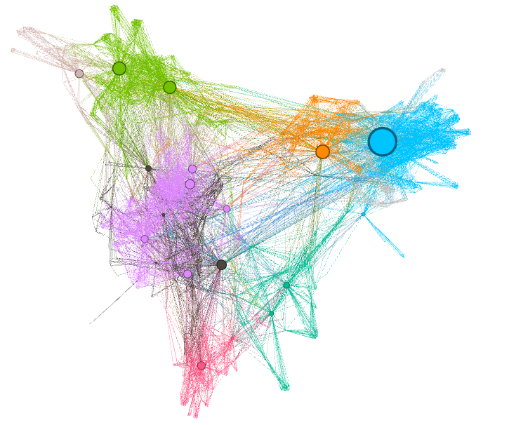
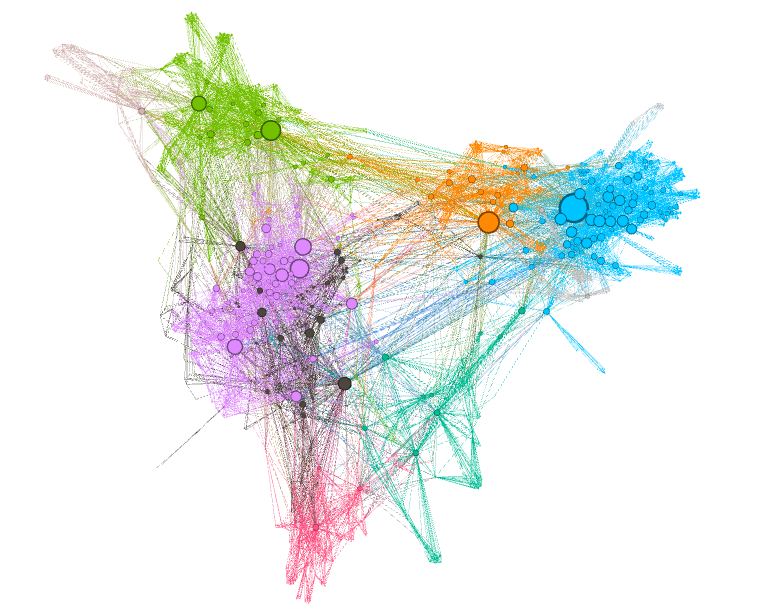
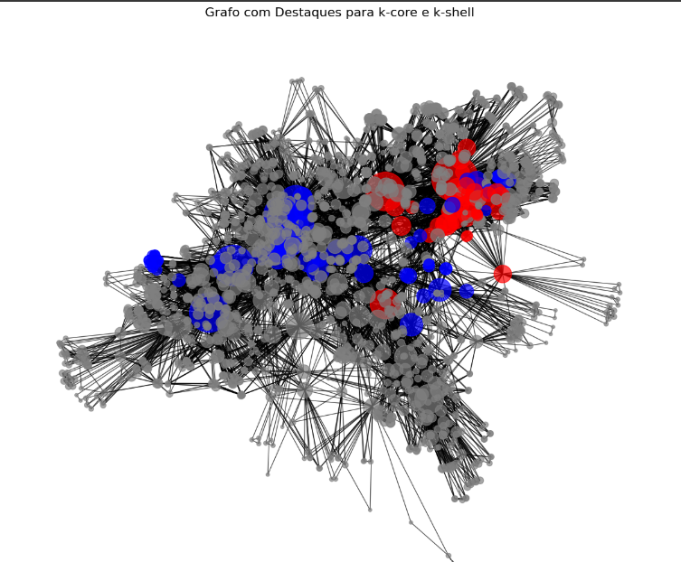
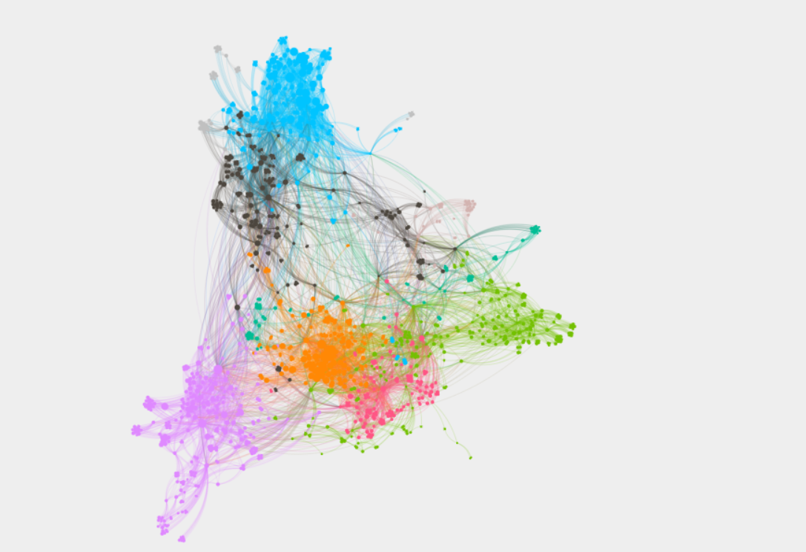

# Trabalho 1 Unidade 2
### Esse trabalho tem como objetivo aplicar os conceitos aprendidos durante o curso para analisar a rede de co-autoria dos professores permanentes do Programa de Pós-Graduação em Engenharia Elétrica e de Computação (PPgEEC), utilizando a ferramenta Gephi.

#### Estudantes: Gabriel Vitor Pereira dos Santos e João Victor Soares da Silva Vieira.

### 🔗 Video com a explicação do trabalho. [here]().

#### Referências:

- :books: [Coscia, Michele. The Atlas for the Aspiring Network Scientist](https://www.networkatlas.eu/)
- :books: [Gephi, The Open Graph Viz Platform](https://gephi.org/)
# 1. Degree Centrality
* **O que é?**
* A Degree Centrality mede o número de conexões (arestas) que um nó tem. Em outras palavras, ela indica o grau de conexão de cada autor com outros autores. Quanto maior o número de conexões, mais central o nó é na rede.
* **O que significa no contexto do trabalho?**
* Autores com alto Degree Centrality são aqueles que possuem muitas colaborações com outros professores do programa, ou seja, são autores mais conectados, provavelmente com maior interação acadêmica e impacto dentro do grupo de co-autoria.
Interpretando o gráfico:
* Vértices grandes (mais conectados) indicam autores com mais colaborações, enquanto vértices pequenos (menos conectados) indicam autores com poucas colaborações.

# 2. Closeness Centrality
* **O que é?**
* A Closeness Centrality mede a proximidade de um nó em relação a todos os outros na rede, ou seja, quão rapidamente um nó pode alcançar os outros nós. Ela é calculada com base na soma das distâncias mais curtas de um nó para todos os outros nós.
* **O que significa no contexto do trabalho?**
* Autores com alta Closeness Centrality são aqueles que estão "próximos" de todos os outros, ou seja, podem estabelecer colaborações rapidamente com outros membros do programa. São autores com boa acessibilidade e potencial para se conectar rapidamente com diferentes grupos de pesquisa.
Interpretando o gráfico:
* Vértices com cores mais intensas ou tamanhos maiores indicam autores mais centrais, ou seja, aqueles que podem alcançar mais rapidamente outros pesquisadores na rede de co-autoria.

* 3. Betweenness Centrality
* **O que é?**
* A Betweenness Centrality mede a importância de um nó como intermediário nas conexões entre outros nós. Ele calcula quantas vezes um nó aparece no caminho mais curto entre outros pares de nós. Um nó com alta betweenness centrality atua como um "ponte" ou "conector" na rede.
* **O que significa no contexto do trabalho?**

* Autores com alta Betweenness Centrality desempenham um papel crucial na comunicação e colaboração entre diferentes grupos dentro da rede. Eles são os "intermediários" ou "conectores" entre pesquisadores que, de outra forma, poderiam estar distantes uns dos outros. Esse tipo de autor pode ser fundamental para promover novas colaborações entre diferentes áreas de pesquisa.
Interpretando o gráfico:

* Vértices com tamanhos grandes indicam autores que têm um papel importante como intermediários, facilitando a comunicação entre diferentes grupos ou áreas de pesquisa dentro do programa.

# 4. Eigenvector Centrality
* **O que é?**

* A Eigenvector Centrality é uma medida que não apenas considera o número de conexões de um nó, mas também a qualidade dessas conexões. Se um nó está conectado a outros nós importantes, ele também será considerado importante. Essa métrica leva em conta a centralidade dos nós aos quais o nó está conectado.
* **O que significa no contexto do trabalho?** 

* Autores com alta Eigenvector Centrality são aqueles conectados a outros autores igualmente importantes ou centrais na rede. Esses autores são bem conectados e suas colaborações tendem a ser com outros pesquisadores de destaque. Isso pode indicar que eles estão envolvidos em projetos de maior impacto ou são mais influentes no programa.
Interpretando o gráfico:

* Vértices com cores mais intensas ou tamanhos maiores indicam autores que não só têm muitas conexões, mas suas colaborações são com outros autores influentes, formando uma rede densa de influências mútuas.

------------------------------------------------
## K-core: Identificar grupos de professores com colaboração intensa e forte conectividade.
## K-shell: Verificar como essa colaboração se organiza em diferentes camadas, desde os grupos mais centrais até os mais periféricos.

## Deseja interagir no grafo de maneira mais detalhada?

[Clique-me](https://newgabrielvi.github.io/grafo-tempor-rio/)

