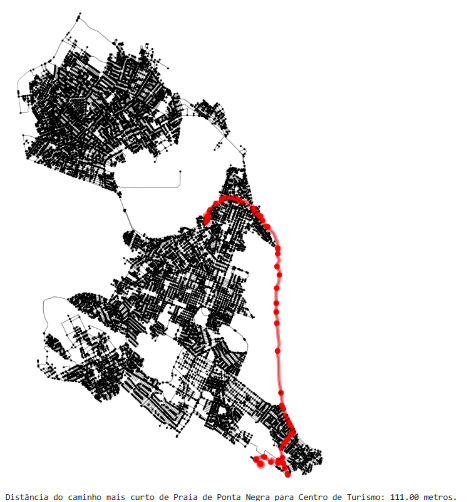
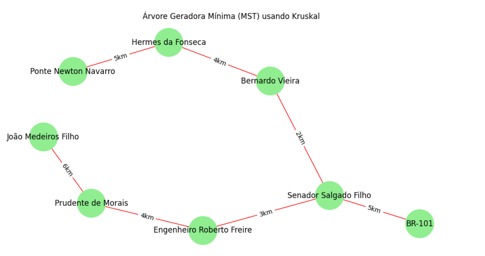
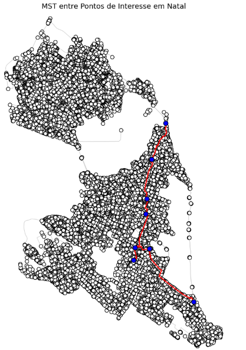

# Trabalho 3 Unidade 2
#### Estudante: Gabriel Vitor Pereira dos Santos.

### 🔗 Video com a explicação do trabalho. [here](https://www.loom.com/share/387cd83ff2214e39ac4165549769e642?sid=f6dc33ff-851d-4f42-859e-dbc7bb97ef96).

#### Referências:

- :books: [Coscia, Michele. The Atlas for the Aspiring Network Scientist](https://www.networkatlas.eu/)
- 💻:[Week 12, References for unit 2 project, Ivanovitchm](https://github.com/ivanovitchm/datastructure)

### Requesitos:
#### 1. Escolher pontos de interesses para análise de MST (kruskal).
#### 2. dijkstra:
#### 2.1 Encontrando o vértice com a menor distância
#### 2.2 Repetindo a iteração principal para todos os vértices
#### 2.3 Relaxando as arestas
  -----------------------------------------------
  ## Para a comparação de algoritmos em `U2T3.ipynb` instale o necessário:
  `import osmnx`
  `import networkx`
  
# Utilizando dijkstra:
 ## Com o uso dos pontos de interesse:
### 1. Praia de Ponta Negra: (-5.8985, -35.1906)
### 2. Centro de Turismo: (-5.7866, -35.2119)
### 3. Catedral de Natal: (-5.7942, -35.2117)
### 4. Museu Câmara Cascudo: (-5.7947, -35.2111)
### 5. Parque das Dunas: (-5.8221, -35.2057)
### 6. Fortaleza dos Reis Magos: (-5.7989, -35.2073)
### 7. Praia do Forte: (-5.7960, -35.2046)
### 8. Shopping Midway Mall: (-5.8192, -35.2025)
### 9. Teatro Alberto Maranhão: (-5.7972, -35.2091)
### 10. Arena das Dunas: (-5.8199, -35.2115)

# Conseguimos o caminho mais curto que foi de 111.000 metros.

# Usando kruskal e escolhendo pontos de interesse para MST:
 ## Pontos de interesse:
### 1. BR-101: (-5.844409, -35.215984)
### 2. Senador Salgado Filho: (-5.817583, -35.208484)
### 3. Engenheiro Roberto Freire: (-5.868700, -35.179288)
### 4. Prudente de Morais: (-5.837101, -35.215086)
### 5. João Medeiros Filho: (-5.785983, -35.205241)
### 6. Ponte Newton Navarro: (-5.763212, -35.198965)
### 7. Hermes da Fonseca: (-5.837541, -35.206730)
### 8. Bernardo Vieira: (-5.809407, -35.208136)
# Análise de Infraestrutura Crítica:
### Identificar estradas ou interseções críticas comparando a MST com a rede viária original, destacando as vias essenciais para manter a conectividade.

# Desempenho do kruskal:
# Observação: Ponto crítico pode ser considerado importante para o estado ou organização responsável por aquele trecho em NATAL/RN.

